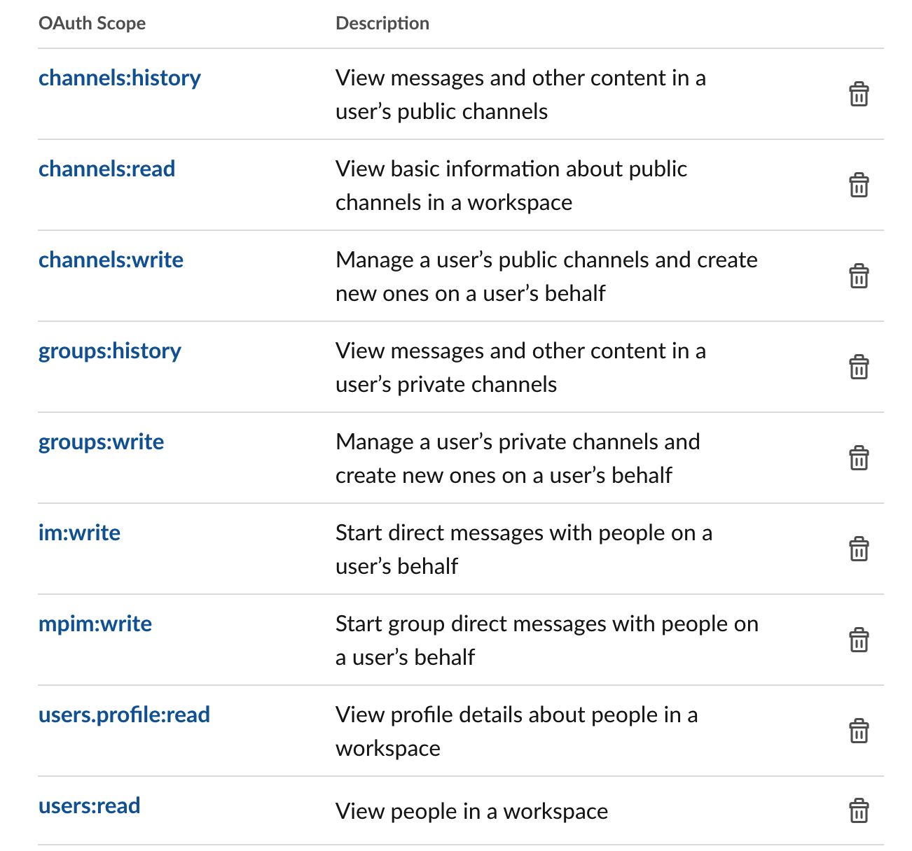

# slack-audit
Companion code for a 2021 lightning talk at NICAR called "Body Commodification: What diversity stats get wrong and how we can do better."

**This repository contains:**

🔗 a link to the talk slides

🥎 a script to fetch Slack messages 

📊 a notebook to analyze the data

## read the slides
The talks slides are available at [this link](https://docs.google.com/presentation/d/1NwBzpMZawp4HRLkB-BHb2BOvRK4DGCN4brlHJwdja_A/edit). (The speaker notes contain the exact presentation script and every image has alternate text.)

[](https://docs.google.com/presentation/d/1NwBzpMZawp4HRLkB-BHb2BOvRK4DGCN4brlHJwdja_A/edit)

## scrape slack 
To pull your organization's Slack message history:

1. Create a [Slack App](https://api.slack.com/apps) with the following permissions:



2. Prepare your development environment (assumes you have Docker installed on a Mac**):
```
brew bundle 
kar build && kar run bash
```

3. Scrape the messages from a channel, using the token for your Slack App:
```
python scrape_slack.py -t <token> -c <channel> -d <days>
```

** If you're not on a Mac or would prefer not to install Docker, you can install the requirements on your own machine: 
```
pip install -r requirements.txt
```

## analyze the data

